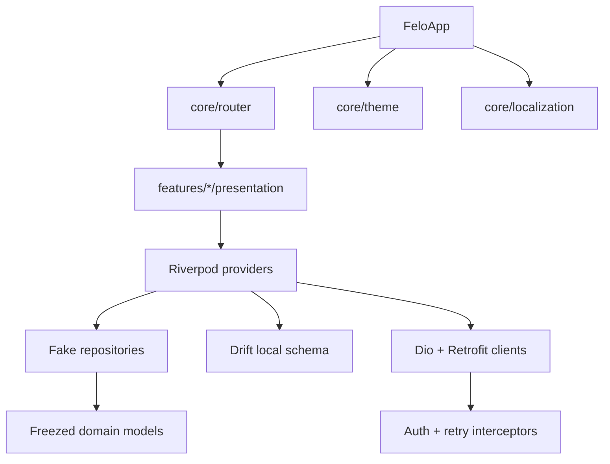

# Felo Mobile

Felo is a no-custody personal finance companion for Pakistani diaspora households and Pakistan-resident budgeters. **9 of 13 backable domains are now wired live to the NestJS + Supabase backend** (Budgets, Goals, Transactions, Accounts, Bills, Splits, Profile, Notifications, Coach). Family / Send-money / SMS-parser / Remittance stay on Phase-1 fakes — no backend counterpart yet.

No payments, custody, KYC, or regulated money movement are implemented in this phase.

## Active workstream — Onboarding v2

The 8-phase onboarding journey is being built side-by-side with the existing
flow under [`lib/features/onboarding_v2/`](./lib/features/onboarding_v2/).
See [`docs/`](./docs/) for the staged execution model (Stages 0-7 with
review gates). Feature flag: `--dart-define=FELO_USE_ONBOARDING_V2=true`.

## Stack

- Flutter 3.x, Dart 3.x, Material 3
- Riverpod 2.x with code generation
- `go_router` typed route declarations
- Dio + Retrofit with auth and retry interceptors
- Drift SQLite schema for offline-first local data
- `flutter_secure_storage` for tokens and local secrets
- Firebase Auth / Crashlytics packages scaffolded
- PostHog package scaffolded
- ARB localization: English and Urdu
- Android SMS parser package present, using local fixture data for now
- `flutter_test`, `mocktail`, and `golden_toolkit`

## Architecture



Feature folders follow:

```text
lib/
  core/
  features/
    auth/
    onboarding/
    budgets/
    goals/
    transactions/
    sms_parser/
    coach/
    family/
    remittance_stub/
    profile/
  shared/
```

Each feature is split into `data`, `domain`, and `presentation` where applicable. Widgets consume providers and mock data only.

## Current Slice

Implemented:

- Splash and 4-slide onboarding flow
- SMS trust explainer sample design
- Auth screen scaffold
- Home dashboard with seeded mock data
- Budgets list, detail, create/edit scaffold
- Goals list and detail
- Transactions feed and detail
- SMS parser status screen from fixture data
- Coach chat scaffold with education disclaimer
- Family mode member list
- Profile/settings scaffold
- Remittance waitlist stub
- Reusable Felo components and golden coverage
- Drift schema: users, accounts, transactions, budgets, goals, family members

## Setup

Use the local Flutter SDK if it is not already on PATH:

```sh
export PATH="$HOME/flutter/bin:$PATH"
flutter --version
flutter pub get
flutter gen-l10n
dart run build_runner build --delete-conflicting-outputs
```

## Environment

No real backend keys are required for this phase.

Future environment variables:

```text
FELO_API_BASE_URL=
POSTHOG_API_KEY=
POSTHOG_HOST=
FIREBASE_PROJECT_ID=
```

Firebase platform files are intentionally not committed yet because no live Firebase project is wired.

## Run

```sh
flutter run
```

## Quality

```sh
flutter analyze
flutter test
flutter test --update-goldens test/golden
```

## Build

```sh
flutter build apk --debug
flutter build ios --release --no-codesign
```

Release signing, Firebase config, and production PostHog configuration are deferred until backend/platform ownership is ready.
