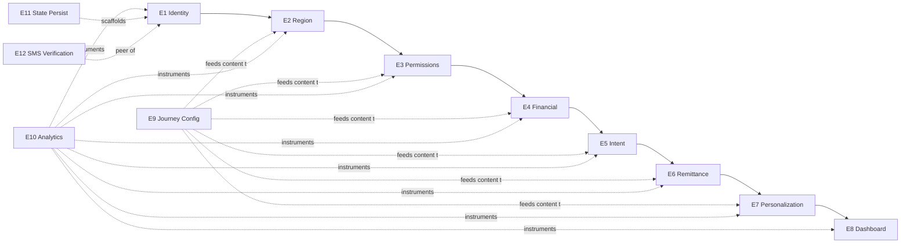

# Onboarding v2 — Epics

> **Companion to:** [`sprint-1.md`](./sprint-1.md) · [FRD](../03-frd/frd-onboarding.md)
> **Date:** 2026-04-26 · **Status:** Awaiting Review Gate 5 approval.
>
> 12 epics group the 78 FRs from Stage 4. Each epic is a unit of
> deliverable scope; each story (in `sprint-1.md`) maps to one or more FRs.

---

## E1 — Identity & Auth (Phase 1)

**Goal:** A new user can authenticate via OAuth or OTP and reach Phase 2.

- **FRs covered:** FR-1.1.1, FR-1.2.1, FR-1.2.2, FR-1.2.3, FR-1.2.4, FR-1.2.5, FR-1.2.6, FR-1.3.1, FR-1.3.2 (9 FRs)
- **Dependencies:** Supabase Auth (existing); SMS Verification module (E12 ships in parallel)
- **Definition of done:** Saadia (P1) can sign in via Google in 2 taps; Bushra (P4) can sign up via Email + OTP; Daniyal (P3) via Apple; OTP TTL/attempts/resends per D-011 enforced.

## E2 — Region & Profile Context (Phase 2)

**Goal:** Region auto-detected from IP; user can confirm or override; secondary regions added; name captured.

- **FRs covered:** FR-2.1.0, FR-2.1.1, FR-2.1.2, FR-2.1.3, FR-2.2.1, FR-2.2.2 (6 FRs; FR-2.1.0 is server-side resolver)
- **Dependencies:** MaxMind GeoLite2 license; IP resolver service (built in this epic)
- **Definition of done:** H1 measurable (≥95% IP-pre-detected completion); secondary regions cap=3 enforced; Daniyal sees CA pre-selected.

## E3 — Permissions Layer (Phase 3)

**Goal:** SMS / Notifications / Location / Contacts permissions captured with per-card WHY copy.

- **FRs covered:** FR-3.0.1, FR-3.0.2, FR-3.1.1, FR-3.2.1, FR-3.3.1, FR-3.4.1 (6 FRs)
- **Dependencies:** Permission cards seeded in `006_…sql`; `flutter_sms_inbox` (existing); platform check for SMS card (Android-only)
- **Definition of done:** H3 measurable (≥75% SMS grant rate); iOS hides SMS card; "to this device" copy from D-014.

## E4 — Financial Profile Capture (Phase 4)

**Goal:** Earning types, accounts, investment gate, investment types captured.

- **FRs covered:** FR-4.1.1, FR-4.1.2, FR-4.1.3, FR-4.2.1, FR-4.2.2, FR-4.2.3, FR-4.2.4, FR-4.3.1, FR-4.3.2, FR-4.4.1, FR-4.4.2 (11 FRs)
- **Dependencies:** Reference tables (`earning_types_master`, `banks`, `wallets`, `investment_types_master`); Journey config service (E9)
- **Definition of done:** Faisal sees Wise in PK list; Bushra can toggle UAE banks; Saadia skips invest path cleanly.

## E5 — Intent: Budget & Goals (Phase 5)

**Goal:** Monthly budget set with template-driven pre-fills; exactly 2 goals captured.

- **FRs covered:** FR-5.1.1 through FR-5.1.5, FR-5.2.1 through FR-5.2.6 (11 FRs)
- **Dependencies:** `budget_templates` reference; `goal_templates` reference; multi-currency picker logic (D-021)
- **Definition of done:** D-008 enforced (UI disables Continue at 0/1, FIFO at 3rd tap, backend rejects !=2, DB index on `(user_id, slot)` partial unique); D-020 bidirectional family-contribution; multi-currency goals persist correctly.

## E6 — Remittance Corridor (Phase 6, conditional)

**Goal:** Family/remittance multi-select drives conditional corridor capture per D-023 truth table.

- **FRs covered:** FR-6.1.1, FR-6.1.2, FR-6.1.3, FR-6.2.1, FR-6.2.2, FR-6.2.3 (6 FRs)
- **Dependencies:** `family_remittance_options` reference with `triggers_step2` flag; corridor pre-fill logic (D-024)
- **Definition of done:** Sana skips 6.2 entirely; Daniyal sees "Send to: Pakistan" pre-filled; Faisal sees "Receive from: USA" pre-filled.

## E7 — Personalization Engine (Phase 7)

**Goal:** Loading screen with user-input-referenced status messages; backend builds profile/budget/goals/dashboard config in parallel.

- **FRs covered:** FR-7.0.1 through FR-7.0.8, FR-7.1.1, FR-7.1.2, FR-7.1.3 (11 FRs)
- **Dependencies:** All prior phases' data; `phase7_status_templates` reference; FX/market data services (placeholder OK for v1)
- **Definition of done:** H7 measurable (≤5% backgrounding); messages reference actual inputs; D-026 timeout/error handling implemented; total Phase 7 ≤5s.

## E8 — Dashboard Handoff (Phase 8)

**Goal:** Configurable widget grid renders per persona; D-010 success criterion met (every input visible).

- **FRs covered:** FR-8.1.1 through FR-8.1.9, FR-8.2.1 (10 FRs — Phase 8 widget grid + tooltip)
- **Dependencies:** Dashboard config built in Phase 7 (FR-7.0.3); earning-type widget precedence (D-015)
- **Definition of done:** 5 integration tests pass (one per persona); each persona's expected widget set renders exactly per `personas.md` contract table.

## E9 — Journey Config Service (cross-cutting, D-029)

**Goal:** Single `/v1/onboarding/journey-config` endpoint returns all DB-driven content; Flutter caches with version-hash invalidation.

- **FRs covered:** FR-9.0.1, FR-9.0.2, FR-9.0.3 (3 FRs)
- **Dependencies:** All reference tables in `006_…sql`; CDN cache config (Cloudflare); journey_config_versions trigger
- **Definition of done:** Adding a new bank via SQL → version bump → next app foreground reflects new bank; Flutter falls back to bundled config on network failure.

## E10 — Multi-sink Analytics (cross-cutting, D-030)

**Goal:** Every onboarding event fires to Postgres events table + GTM dataLayer + Meta CAPI; extensible for TikTok/Snap.

- **FRs covered:** FR-10.0.1 through FR-10.0.6 (6 FRs)
- **Dependencies:** `events` + `funnel_sessions` tables (`006_…sql`); Meta CAPI access token; GTM container ID; `OnboardingAnalyticsMixin` Flutter implementation
- **Definition of done:** One synthetic onboarding session produces events in all 3 sinks; Stage 6 funnel queries return sensible numbers; D-001 traceability rule enforced (every event has frd_id).

## E11 — State Persistence & Navigation (cross-cutting, D-009)

**Goal:** Write-on-Continue, resume-from-last-completed-step, edit-earlier-answer cascade.

- **FRs covered:** FR-11.0.1, FR-11.0.2, FR-11.0.3, FR-11.0.4 (4 FRs)
- **Dependencies:** `flutter_secure_storage` (existing); `onboarding_state` table (`006_…sql`)
- **Definition of done:** H10 measurable (≥40% resume rate within 24h); cold-kill mid-flow → resume at last Continue; primary region change after bank selection → bank list re-prompt.

## E12 — SMS Verification (cross-cutting, D-005..D-007, D-014)

**Goal:** Pluggable corridor-keyed SMS provider chain; IP-based primary routing with E.164 fallback; OTP storage with replay protection.

- **FRs covered:** FR-12.0.1, FR-12.0.2, FR-12.0.3, FR-12.0.4 (4 FRs)
- **Dependencies:** `phone_otp_challenges` table; at least one signed SMS vendor contract (Twilio fallback acceptable); env-driven provider activation
- **Definition of done:** OTP arrives within 30s for Saadia (PK), Daniyal (CA), Bushra (PK email path skips this); ConsoleLogger for dev mode logs OTP without sending.

---

## Cross-epic dependencies

**Critical-path order:** E11 + E9 + E12 + E10 must ship **before or in
parallel with** E1, otherwise auth has nothing to persist into and no
analytics fires.

**Implementation order suggestion:**
1. Database migrations (`006_…sql`) + reference data seeds
2. E9 Journey Config service (so frontend has content to render)
3. E11 State Persistence scaffold
4. E10 Multi-sink Analytics dispatcher + mixin
5. E12 SMS Verification module
6. E1 → E8 in journey order
